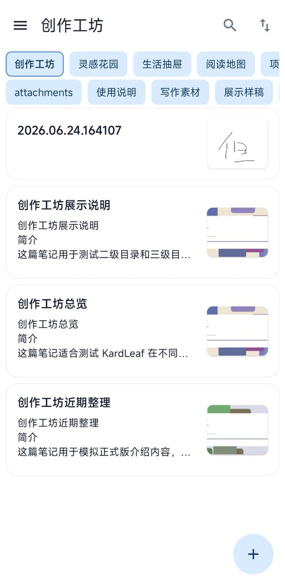
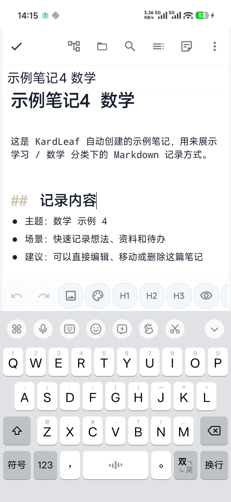
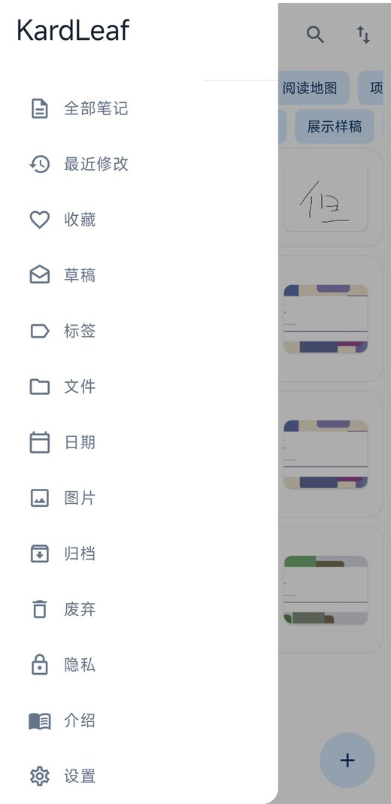
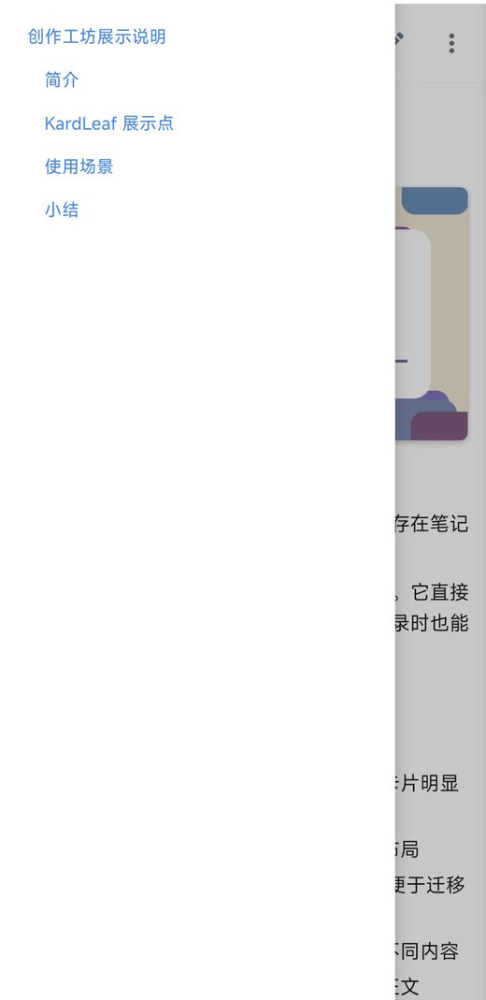
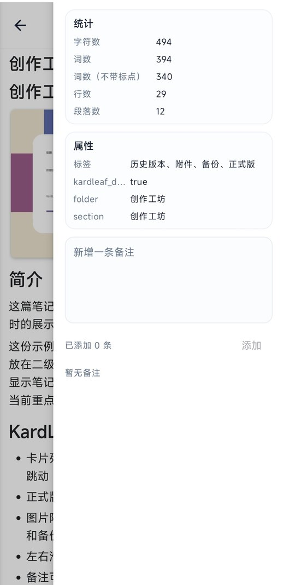
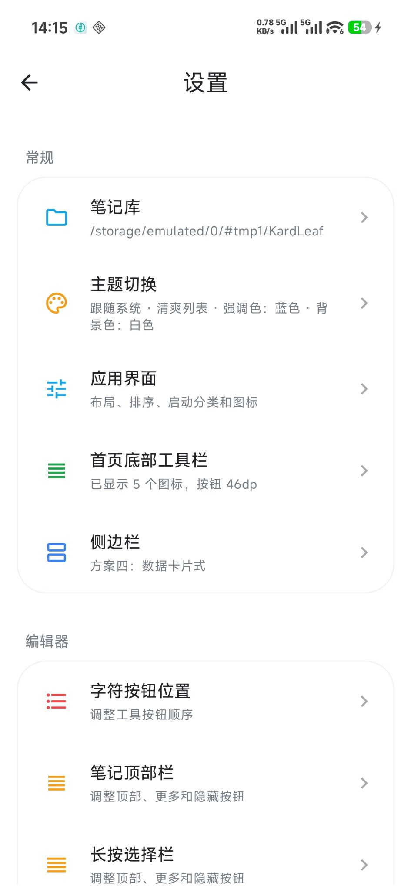
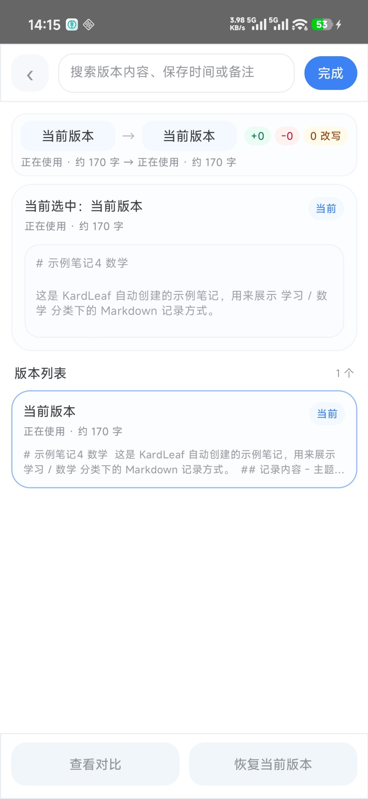
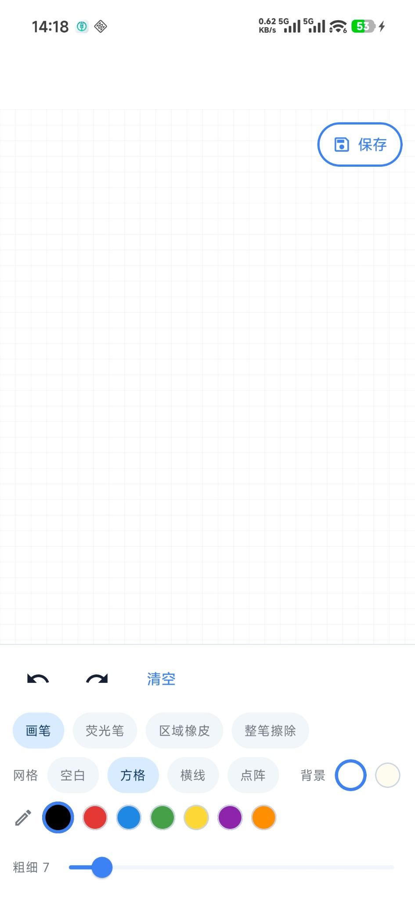
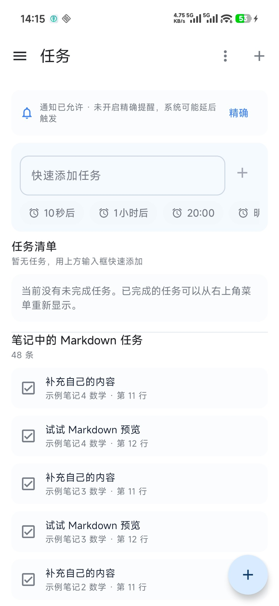

# KardLeaf / 卡叶笔记

<p align="center">
  <strong>本地优先、实时编辑、实时预览的 Android Markdown 笔记应用</strong>
</p>

<p align="center">
  <a href="https://github.com/waikr/KardLeaf/releases"></a>
  <a href="LICENSE"></a>
  
  
  
</p>

<p align="center">
  <a href="https://github.com/waikr/KardLeaf/releases">下载最新版</a>
  ·
  <a href="#界面预览">界面预览</a>
  ·
  <a href="#核心亮点">核心亮点</a>
  ·
  <a href="#外部-url-新建笔记">外部 URL</a>
  ·
  <a href="#如何运行">如何运行</a>
</p>

<p align="center">
  
  
  
</p>

KardLeaf 是一款轻量、简洁、偏本地优先的 Android Markdown 笔记应用。它不会把正文锁进应用私有数据库，而是把笔记保存为真实的 `.md` / `.txt` 文件，方便备份、迁移、同步，也方便继续用 Obsidian、VS Code、Typora 等工具管理同一批文件。

它支持 **实时编辑、实时预览**，并兼容 Obsidian 常见 Markdown 文件、文件夹结构、`#标签` 和 YAML 属性（front matter）工作流。

---

## 核心亮点

<table>
  <tr>
    <td width="42" align="center">✍️</td>
    <td><strong>实时编辑</strong><br />直接在手机上编辑 Markdown，配合标题、列表、任务、图片、代码块、数学公式和常用格式按钮，快速记录更顺手。</td>
  </tr>
  <tr>
    <td width="42" align="center">👁️</td>
    <td><strong>实时预览</strong><br />编辑和预览可以快速切换，适合边写边检查排版、图片、任务列表和 Markdown 渲染效果。</td>
  </tr>
  <tr>
    <td width="42" align="center">🧩</td>
    <td><strong>兼容 Obsidian 文件和标签属性</strong><br />支持读取普通 Markdown 文件、目录分类、<code>#标签</code> 和 YAML 属性，适合作为 Obsidian 本地笔记库的移动端补充。</td>
  </tr>
  <tr>
    <td width="42" align="center">📁</td>
    <td><strong>本地文件优先</strong><br />笔记保存在你选择的目录中，正文是普通 Markdown / TXT 文件，迁移、备份和同步更直接。</td>
  </tr>
  <tr>
    <td width="42" align="center">🗂️</td>
    <td><strong>分类清晰</strong><br />支持多级目录、顶部分类、下拉分类面板和侧边栏导航，适合按学习、生活、项目等场景整理。</td>
  </tr>
  <tr>
    <td width="42" align="center">🔗</td>
    <td><strong>外部 URL 新建笔记</strong><br />支持通过 <code>kardleaf://new</code> 从浏览器、自动化工具或其他应用快速新建笔记，并可传入标题、正文、网页地址、保存目录和置顶状态。</td>
  </tr>
  <tr>
    <td width="42" align="center">🎨</td>
    <td><strong>可调整界面</strong><br />支持主题、强调色、首页底部工具栏、笔记顶部栏、侧边栏方案和编辑器按钮位置等自定义。</td>
  </tr>
  <tr>
    <td width="42" align="center">🔒</td>
    <td><strong>隐私友好</strong><br />不强制登录账号，不强制把笔记上传到云端；正文文件仍由你自己掌控。</td>
  </tr>
</table>

---

## 界面预览

### 首页与侧边栏

<p align="center">
  
  
</p>

### 编辑、目录与备注

<p align="center">
  
  
  
</p>

### 设置、历史版本、绘图与任务

<p align="center">
  
  
</p>

<p align="center">
  
  
</p>

---

## 功能特性

<table>
  <tr>
    <td width="42" align="center">🏠</td>
    <td><strong>首页</strong><br />卡片式笔记列表、分类筛选、搜索、排序、收藏、置顶、图片缩略图和底部快捷工具栏。</td>
  </tr>
  <tr>
    <td width="42" align="center">✍️</td>
    <td><strong>编辑器</strong><br />Markdown 实时编辑、实时预览、目录跳转、格式按钮、本地图片引用、数学公式和任务列表。</td>
  </tr>
  <tr>
    <td width="42" align="center">🧩</td>
    <td><strong>Obsidian 工作流</strong><br />兼容本地 Markdown 文件、文件夹分类、标签和属性，适合在电脑端 Obsidian 与手机端 KardLeaf 之间配合使用。</td>
  </tr>
  <tr>
    <td width="42" align="center">📚</td>
    <td><strong>笔记管理</strong><br />多级文件夹、草稿、归档、回收站、历史版本、备注记录、属性统计和外部文件刷新。</td>
  </tr>
  <tr>
    <td width="42" align="center">🔗</td>
    <td><strong>外部调用</strong><br />支持通过自定义 URL Scheme 新建笔记，可用于网页链接、桌面快捷方式、Tasker、自动化脚本和其他应用之间的联动。</td>
  </tr>
  <tr>
    <td width="42" align="center">✅</td>
    <td><strong>任务</strong><br />支持笔记中的 Markdown 任务识别，也支持独立任务清单和提醒入口。</td>
  </tr>
  <tr>
    <td width="42" align="center">🖼️</td>
    <td><strong>图片与绘图</strong><br />支持本地图片预览、首页首图缩略图，以及内置绘图功能。</td>
  </tr>
  <tr>
    <td width="42" align="center">☁️</td>
    <td><strong>同步思路</strong><br />以本地文件夹为基础，可配合 WebDAV、Syncthing、网盘目录或手动复制进行多端同步。</td>
  </tr>
</table>

---

## 本地 Markdown 与 Obsidian 兼容

KardLeaf 的核心是 **文件夹 + Markdown 文件 + 标签属性**。

你可以把笔记库放在普通目录中，也可以把它作为 Obsidian、VS Code、Typora 等 Markdown 工具的移动端补充：

```text
KardLeaf 笔记库
├── 学习
│   ├── 数学
│   └── 物理
├── 生活
└── 办公
```

支持的常见写法包括：

```markdown
---
tags: [学习, 数学]
created: 2026-07-09
---

# 示例笔记

这是一条带有 #学习 标签的 Markdown 笔记。
```

* 电脑上整理长文档，手机上快速记录和查看。
* 其他编辑器修改 `.md` / `.txt` 文件后，KardLeaf 可刷新索引。
* Obsidian 中的 Markdown 文件、目录结构、标签和属性可以继续保留。
* Room 数据库主要用于索引、缓存和状态管理，正文仍保存在真实文件里。

KardLeaf 不是 Obsidian 官方客户端，也不依赖 Obsidian 的专有功能；它更适合作为本地 Markdown 工作流的 Android 补充。

---

## 外部 URL 新建笔记

KardLeaf 支持通过自定义 URL Scheme 从浏览器、网页、自动化工具、桌面快捷方式或其他 Android 应用中打开新建笔记页面。

### 基本格式

```text
kardleaf://new
```

完整格式：

```text
kardleaf://new?title=标题&content=正文&url=网页地址&path=保存目录&pinned=1&root=0
```

### 支持的参数

| 参数        | 说明                            | 示例                        |
| --------- | ----------------------------- | ------------------------- |
| `title`   | 笔记标题                          | `title=阅读记录`              |
| `content` | 笔记正文，也可以使用 `body` 或 `text`    | `content=稍后整理`            |
| `url`     | 添加到正文中的网页地址                   | `url=https://example.com` |
| `path`    | 保存目录，也可以使用 `folder` 或 `label` | `path=资料/网页收藏`            |
| `pinned`  | 是否置顶新笔记                       | `pinned=1`                |
| `root`    | 是否强制保存到笔记库根目录                 | `root=1`                  |

`pinned` 和 `root` 支持以下表示开启的值：

```text
1
true
yes
y
on
```

其他值均视为关闭。

当 `content` 和 `url` 同时存在时，KardLeaf 会按照以下格式写入正文：

```markdown
正文内容

https://example.com
```

当 `root=1` 时，会忽略 `path` 参数，直接在笔记库根目录新建笔记。

### 示例

只打开新建笔记：

```text
kardleaf://new
```

创建带标题和正文的笔记：

```text
kardleaf://new?title=%E4%BB%8A%E6%97%A5%E8%AE%B0%E5%BD%95&content=%E8%BF%99%E6%98%AF%E7%AC%94%E8%AE%B0%E6%AD%A3%E6%96%87
```

上面的 URL 对应：

```text
标题：今日记录
正文：这是笔记正文
```

收藏一个网页，并保存到“资料/网页收藏”目录：

```text
kardleaf://new?title=%E7%BD%91%E9%A1%B5%E6%94%B6%E8%97%8F&content=%E7%A8%8D%E5%90%8E%E9%98%85%E8%AF%BB&url=https%3A%2F%2Fexample.com&path=%E8%B5%84%E6%96%99%2F%E7%BD%91%E9%A1%B5%E6%94%B6%E8%97%8F
```

创建一条置顶笔记：

```text
kardleaf://new?title=%E9%87%8D%E8%A6%81%E4%BA%8B%E9%A1%B9&content=%E8%AF%B7%E4%BC%98%E5%85%88%E5%A4%84%E7%90%86&pinned=1
```

强制在根目录创建笔记：

```text
kardleaf://new?title=%E5%BF%AB%E9%80%9F%E8%AE%B0%E5%BD%95&root=1
```

### 在网页中调用

```html
<a href="kardleaf://new?title=%E7%BD%91%E9%A1%B5%E6%94%B6%E8%97%8F&url=https%3A%2F%2Fexample.com">
  使用 KardLeaf 收藏
</a>
```

### 使用 ADB 测试

```bash
adb shell am start -a android.intent.action.VIEW -d "kardleaf://new?title=ADB%E6%B5%8B%E8%AF%95&content=%E8%BF%99%E6%98%AF%E9%80%9A%E8%BF%87ADB%E5%88%9B%E5%BB%BA%E7%9A%84%E7%AC%94%E8%AE%B0"
```

### URL 编码

标题、正文、目录和网页地址中如果包含中文、空格、换行、`&`、`#`、`?` 等字符，需要先进行 URL 编码。

例如：

```text
今日笔记
```

编码后为：

```text
%E4%BB%8A%E6%97%A5%E7%AC%94%E8%AE%B0
```

JavaScript 编码示例：

```javascript
const url =
  "kardleaf://new" +
  "?title=" + encodeURIComponent("网页收藏") +
  "&content=" + encodeURIComponent("稍后阅读") +
  "&url=" + encodeURIComponent("https://example.com") +
  "&path=" + encodeURIComponent("资料/网页收藏");

window.location.href = url;
```

当前参数长度限制：

| 内容    |       最大长度 |
| ----- | ---------: |
| 标题    |    120 个字符 |
| 正文    | 50,000 个字符 |
| 网页地址  |  2,048 个字符 |
| 文件夹路径 |    240 个字符 |

---

## 下载

请前往 [Releases](https://github.com/waikr/KardLeaf/releases) 下载最新 APK。下载数量以 README 顶部 GitHub Downloads 徽章统计为准。

---

## 技术栈

* Kotlin
* Jetpack Compose
* Material 3
* Room
* Kotlin Coroutines / Flow
* Android Storage Access Framework
* WebView
* markdown-it
* KaTeX
* Gradle Kotlin DSL

编辑器实现参考了 swarmnote-editor 的部分思路，用于改善 Markdown 编辑体验。

---

## 如何运行

环境要求：

* Android Studio
* JDK 17
* Android 设备或模拟器
* minSdk 23
* targetSdk 34

构建方式：

```bash
git clone https://github.com/waikr/KardLeaf.git
cd KardLeaf
./gradlew assembleDebug
```

也可以直接使用 Android Studio 打开项目，然后运行 `app` 模块。

---

## 当前状态

KardLeaf 仍在持续开发和优化中。当前重点是稳定编辑体验、优化长文本性能、完善图片加载、历史版本、外部同步和整体界面细节。

---

## License

本项目基于 Apache License 2.0 开源。

请在使用、修改或分发本项目代码时遵守相应开源协议。
