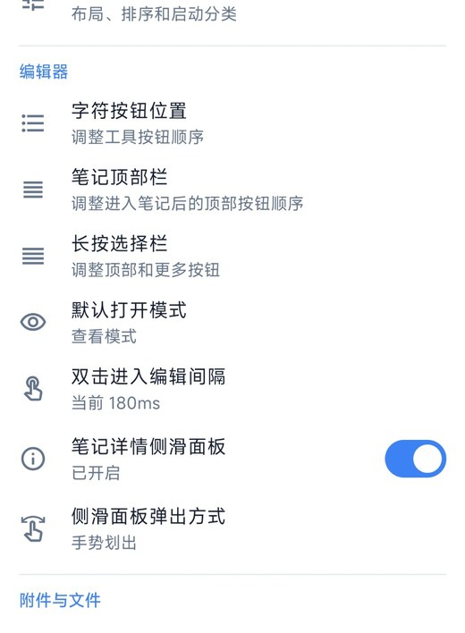

# KardLeaf / 卡叶笔记

<p align="center">
  
  
  
</p>

<p align="center">
  <a href="https://github.com/waikr/KardLeaf/releases"></a>
  <a href="LICENSE"></a>
  
  
</p>

KardLeaf 是一款轻量、简洁、以本地文件为核心的 Android Markdown 笔记应用。

它的重点不是把笔记锁进应用私有数据库，而是让笔记以真实的 `.md` / `.txt` 文件保存在你选择的本地目录中。你可以用 KardLeaf 在手机上快速浏览、分类、编辑和预览，也可以继续用 Obsidian、VS Code、Typora 或其他 Markdown 工具管理同一批文件。

---

## 特色

- **本地文件优先**：笔记以普通 Markdown / TXT 文件保存，方便备份、同步和迁移。
- **双层分类标签**：首页提供两层横向分类入口，适合按「大类 → 子类 / 标签」组织笔记。
- **卡片式首页**：用标题、正文预览和图片缩略图快速浏览笔记内容。
- **Markdown 编辑与预览**：支持常用 Markdown 输入辅助、目录、任务列表、代码块、数学公式和本地图片预览。
- **Obsidian 兼容**：基于标准 Markdown 和本地文件夹结构，适合作为 Obsidian 工作流的移动端补充。
- **本地索引加速**：Room 数据库只用于索引、缓存和状态管理，正文仍保存在真实文件中。
- **隐私友好**：不依赖账号登录，不强制使用云端服务。

---

## 双层分类标签

KardLeaf 的首页支持双层分类显示，不只是普通的单层文件夹列表。

第一层可以作为主要分类，例如：

```text
创作工坊 / 灵感花园 / 生活抽屉 / 阅读地图
```

第二层可以作为当前分类下的子分类、主题或标签，例如：

```text
使用说明 / 写作素材 / 展示样稿 / attachments
```

这样可以把笔记组织成更接近真实写作和资料管理的结构：

```text
创作工坊
├── 使用说明
├── 写作素材
└── 展示样稿
```

在这种结构下，首页仍然保留搜索、排序、卡片预览、图片缩略图和快速新建等操作。

---

## 和 Obsidian 的兼容方式

KardLeaf 的兼容重点是 **Markdown 文件层面的兼容**。

你可以把 KardLeaf 的笔记库放在一个普通文件夹中，也可以把它和 Obsidian 使用的 Markdown 文件夹配合使用。KardLeaf 会读取和保存 `.md` / `.txt` 文件，其他 Markdown 编辑器修改文件后，KardLeaf 也可以通过外部文件同步刷新索引。

适合的使用方式：

- 在电脑上用 Obsidian 管理和整理 Markdown 笔记。
- 在 Android 手机上用 KardLeaf 快速查看、编辑、分类和预览。
- 使用 Syncthing、坚果云、网盘同步目录或手动复制文件进行多端同步。
- 保留 Markdown 原文件，不把笔记绑定在单一应用里。

KardLeaf 不是 Obsidian 官方客户端，也不依赖 Obsidian 的专有功能；它更适合作为本地 Markdown 工作流的 Android 补充。

---

## 界面预览

| 首页双层分类 | 详情侧滑面板 | Markdown 目录 |
| --- | --- | --- |
|  |  |  |

| 侧边栏导航 | 编辑器设置 |
| --- | --- |
|  |  |

---

## 功能特性

- 本地 Markdown / TXT 笔记管理
- 通过 Android SAF 选择和访问本地笔记目录
- 双层分类标签与多级目录管理
- 卡片式首页与正文预览
- 图片缩略图和本地图片引用预览
- Markdown 编辑、预览和目录导航
- KaTeX 数学公式预览
- 搜索、排序、收藏、置顶
- 草稿、归档、回收站
- 笔记提醒和系统通知
- 历史版本记录与恢复
- 备注记录和笔记属性统计
- 外部文件变更同步
- 数据导入与导出

---

## 技术栈

- Kotlin
- Jetpack Compose
- Material 3
- Room
- Kotlin Coroutines / Flow
- Android Storage Access Framework
- WebView
- markdown-it
- KaTeX
- Gradle Kotlin DSL

---

## 项目结构

```text
app/src/main/java/com/kangle/kardleaf
├── MainActivity.kt
├── data
│   ├── database        # Room 数据库、Dao、Entity、Migration
│   ├── model           # 数据模型
│   ├── receiver        # 通知、提醒、目录变化监听
│   ├── repository      # 笔记仓库、配置管理、元数据管理
│   └── utils           # 工具类
└── ui
    ├── DashboardScreen.kt
    ├── EditorScreen.kt
    ├── AppDrawer.kt
    ├── MarkwonMarkdownEditText.kt
    ├── EditorUtils.kt
    └── theme
```

---

## 如何运行

环境要求：

- Android Studio
- JDK 17
- Android 设备或模拟器
- minSdk 23
- targetSdk 34

构建方式：

```bash
git clone https://github.com/waikr/KardLeaf.git
cd KardLeaf
./gradlew assembleDebug
```

也可以直接使用 Android Studio 打开项目，然后运行 `app` 模块。

---

## 当前状态

KardLeaf 仍处于持续开发和优化阶段，核心功能已经可用，后续会继续优化长文本编辑性能、图片加载、历史版本管理、外部同步和整体界面体验。

---

## License

本项目基于 Apache License 2.0 开源。

请在使用、修改或分发本项目代码时遵守相应开源协议。
